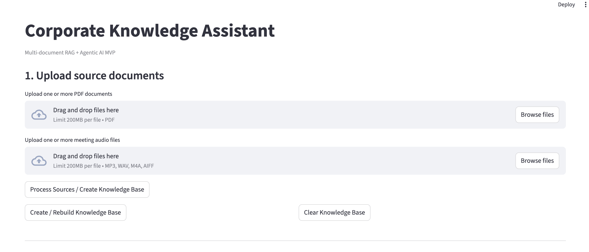
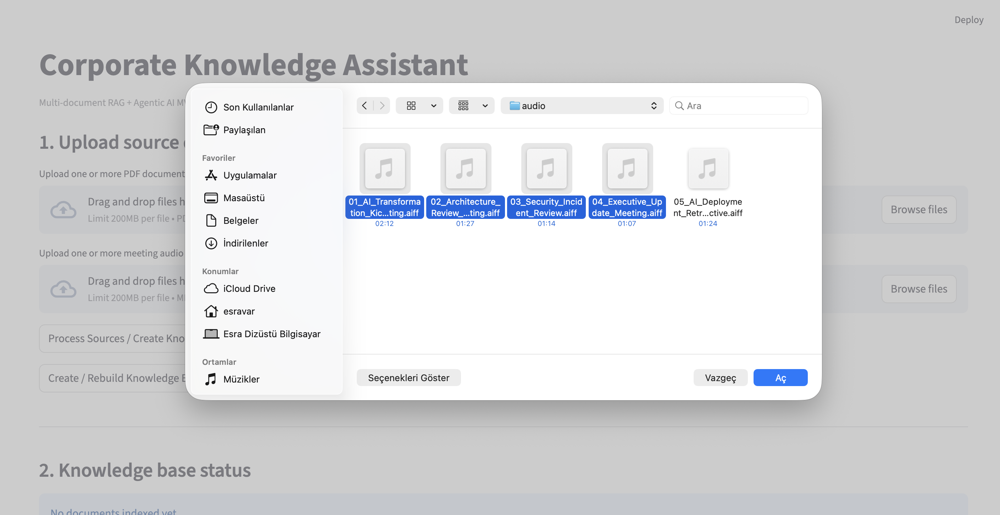
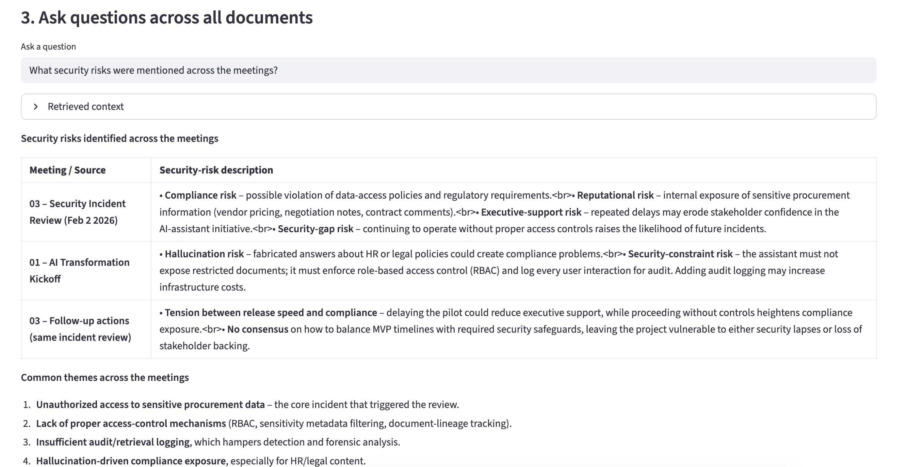

# AI Meeting Intelligence

AI-powered enterprise meeting intelligence platform with:

- Meeting audio transcription
- AI-generated structured meeting notes
- Automatic PDF generation
- RAG-based organizational memory
- Multi-document semantic retrieval
- Multi-model LLM fallback routing

---

## Features

- Upload corporate PDFs
- Upload meeting audio files
- Automatic speech-to-text transcription
- AI meeting summarization
- Structured meeting notes generation
- Vector database indexing with ChromaDB
- Semantic enterprise search
- Multi-model fallback support via OpenRouter

---

## Architecture

```text
Meeting Audio / PDFs
        ↓
Document + Audio Processing
        ↓
Speech-to-Text (Whisper)
        ↓
Meeting Notes Generation
        ↓
PDF Generation
        ↓
Chunking + Embeddings
        ↓
Vector Database (ChromaDB)
        ↓
RAG-based Question Answering
```

---

## Tech Stack

- Python
- Streamlit
- ChromaDB
- Sentence Transformers
- Faster-Whisper
- OpenRouter API
- LangChain
- ReportLab
- Docker

---
## LLM Provider

This project uses OpenRouter with free-tier LLM models for development and experimentation.
The system includes multi-model fallback routing to improve reliability when free models are temporarily rate-limited.

The architecture can easily be upgraded to paid or self-hosted models for production deployments.

## Installation

### Clone repository

```bash
git clone https://github.com/esravar/ai-meeting-intelligence.git
cd ai-meeting-intelligence
```

### Create environment file

Create `.env`:

```env
OPENROUTER_API_KEY=your_api_key_here
```

### Build Docker image

```bash
docker build -t ai-meeting-intelligence .
```

### Run Streamlit app

```bash
streamlit run main.py --server.address=0.0.0.0
```

---

## Usage

1. Upload one or more corporate PDFs
2. Upload one or more meeting audio files
3. Create / rebuild the knowledge base
4. Ask questions across organizational memory

---

## Demo Screenshots

### Main Interface



### File Upload & Knowledge Base Creation



### RAG-based Question Answering



## Future Improvements

- Real-time meeting transcription
- Speaker diarization
- Role-based access control
- Advanced agent workflows
- Hybrid search
- Enterprise authentication